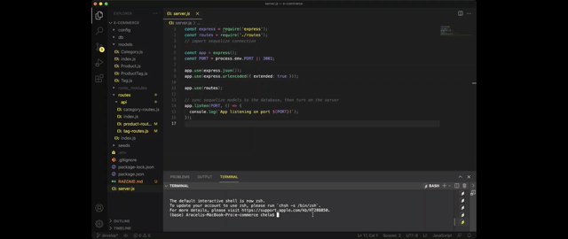
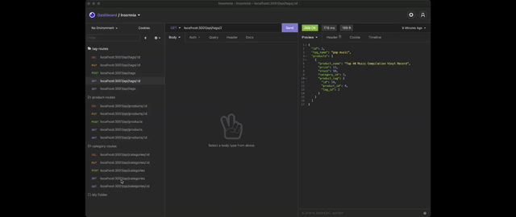

# E-commerce backend
A back-end application for e-commerce sites.

## table of contents 
- [Purpose](#purpose)
- [Technologies-Used](#Technologies-Used)
- [Getting-started](#Getting-started)
- [Contact](#Contact)

## Purpose 
The purpose of this application was to build the back-end for an e-commerce site. The application was bult using Express.js and Node.js and is configured to use Sequelize to interact with a MySQL database. E-commerce, or internet retail, is the largest sector of the electronics industry and these platforms provide a suite of services to businesses of all sizes. Due to the prevelance of these platforms, it is important for developers to understand the fundamental architecture of e-commerce sites.

## Technologies-Used
- Express.js 
- Node.js
- Sequelize
- MySQL 
- Javascript

## Getting-started
To run the application clone the code from the repository. Open your terminal or command line and from the root of the project directory run `npm i` to install the necessary packages. To connect the database type `mysql -u root -p` and press Return in your command shell, enter your MySQL password and press Return again to enter the MySQL shell enviroment. From here create the database with the following command `source db/schema.sql`. Make sure to go into the .env file and change the `DB_USER` and `DB_PW` information with your MySQL info. After run `npm run seed` to seed data to your databse so that you can test the routes in insomnia. Run `npm start` and open up [insomnia](https://insomnia.rest/products/insomnia), or any other API design platform you use, to test the routes. Since this is only the back-end of the application no deployed application is available to view, but you can view a walkthrough video at the following link https://watch.screencastify.com/v/DdYnjOhpaA45n4RtOU0Q.

## Contact
If you have any questions feel free to contact me through my [Github](https://github.com/Araceli4690).